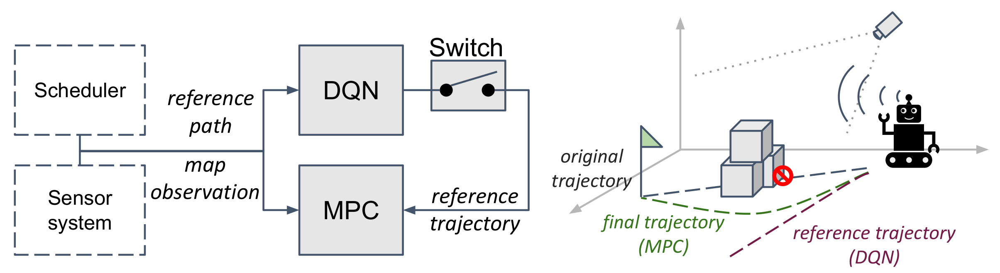

# Title
Collision-Free Trajectory Planning of Mobile Robots by Integrating
Deep Reinforcement Learning and Model Predictive Control

## Publication
The paper is available: [Not Yet] \
Bibtex citation:
```
not yet
```



## Quick Start
### OpEn
The NMPC formulation is solved using open source implementation of PANOC, namely [OpEn](https://alphaville.github.io/optimization-engine/). Follow the [installation instructions](https://alphaville.github.io/optimization-engine/docs/installation) before proceeding. 

### Install dependencies (after installing OpEn)
```
pip install -r requirements.txt
```

### Generate MPC solver
Go to "test_block_mpc.py", change **INIT_BUILD** to true and run
```
python test_block_mpc.py
```
After this, a new directory *mpc_build* will appear and contains the solver. Then, you are good to go :)

### To train the DQN
Go to "test_block_rl.py", change **TO_TRAIN** and **TO_SAVE** to true and run.

## Use Case
Run *main.py* for the simulation in Python. Several cases are available by changing ```scene_option``` in *main.py*.


